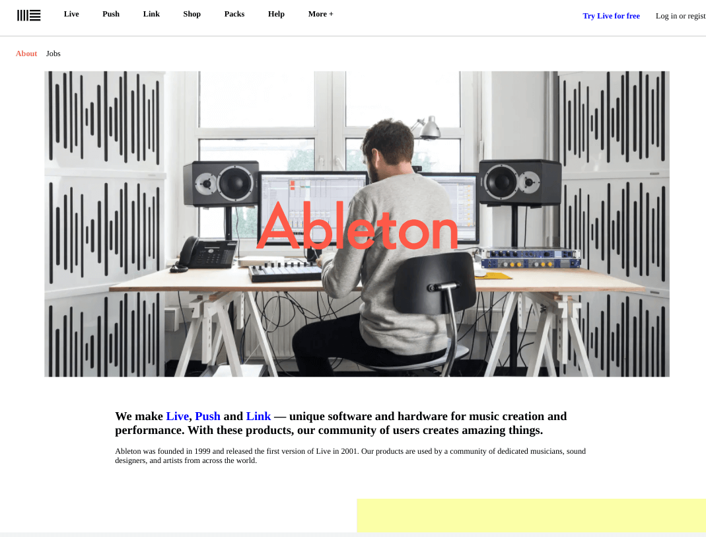
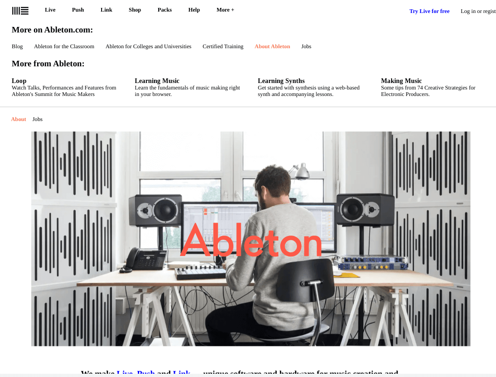
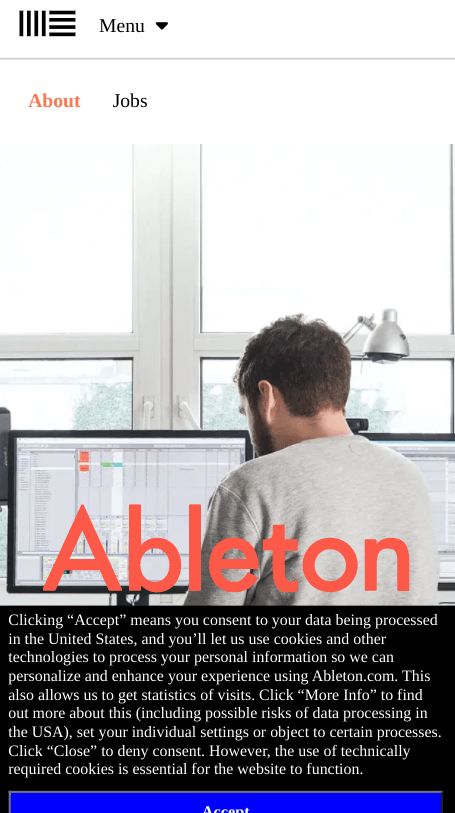
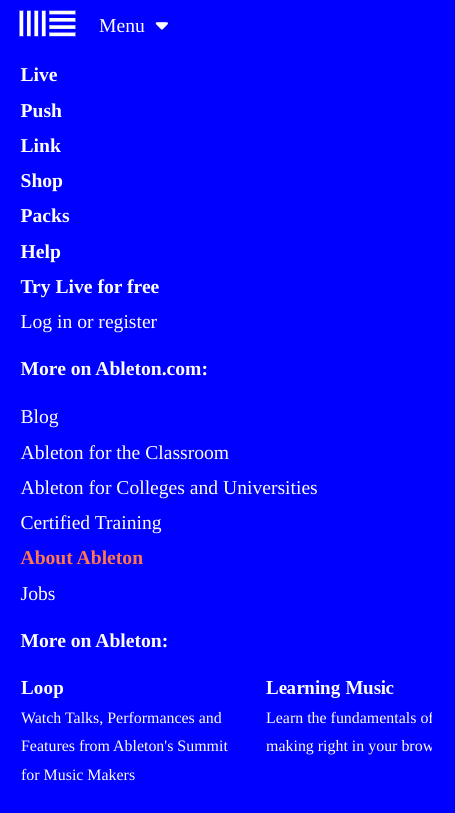

<h1 align="center">Ableton</h1>

   Solution for a challenge from  <a href="https://frontendpractice.com" target="_blank">Frontendpractice.com</a>.

  <h3>
    <a href="https://jdegand.github.io/ableton">
      Github Pages
    </a>
     | 
    <a href="https://www.frontendpractice.com/project/ableton">
      Frontend Practice    
    </a>
  </h3>

## Table of Contents

- [Overview](#overview)
  - [Built With](#built-with)
- [Features](#features)
- [Useful Resources](#useful-resources)

## Overview

### Built With

- Grid 
- Flex

## Features

The [challenge](https://www.frontendpractice.com/project/ableton) was to build an application to complete the following user stories:

- [x] User story: Recreate the layout
- [x] User story: Try building the mega-menu that appears when you click "More +" in the main menu.
- [ ] User story: Is it responsive on mobile? Make the 2nd menu bar sticky on scroll. (*Very* Subtle On real site)

## Useful Resources

- [Ableton](https://web.archive.org/web/20210813094511/https://www.ableton.com/en/about/)
- [Blog](https://moderncss.dev/custom-select-styles-with-pure-css/) - Custom select styles
- [Unicode Tables](https://unicode-table.com/en/sets/arrow-symbols/#down-arrows) - Arrows
- [Content Square](https://contentsquare.com/blog/the-3-golden-rules-of-sticky-menu-navigation/) - Sticky navs
- [Codepen](https://codepen.io/cferdinandi/pen/vYOZMRN) - sticky
- [Designcise](https://www.designcise.com/web/tutorial/how-to-fix-issues-with-css-position-sticky-not-working#checking-if-a-threshold-has-been-specified) - sticky not working
- [Stack Overflow](https://stackoverflow.com/questions/4620906/how-do-i-know-when-ive-stopped-scrolling) - Scroll end
